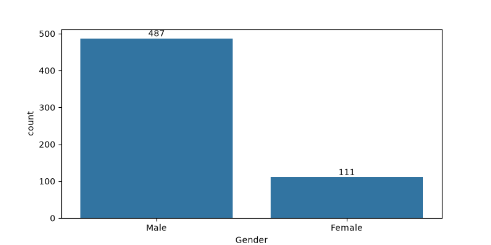
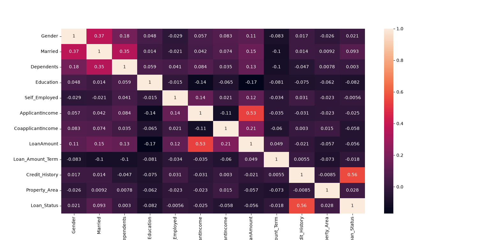

# 🏦 Loan Approval Prediction using Machine Learning

A Machine Learning project that predicts loan approval using Logistic Regression and K-Nearest Neighbors (KNN), with data preprocessing, visualization, and accuracy evaluation.


## Overview

This project predicts whether a loan application will be approved or rejected using Machine Learning classification algorithms.

The project uses a loan dataset containing information about applicants and their loan applications. The data is preprocessed by removing the `Loan_ID` column, encoding categorical features, and handling missing values.

Two Machine Learning classification models are trained and evaluated in this project:

* Logistic Regression
* K-Nearest Neighbors (KNN)


## Technologies Used

* Python
* Pandas
* NumPy
* Matplotlib
* Seaborn
* Scikit-learn


## Dataset

The project uses the following dataset:

```text id="f8e2k1"
loan.csv
```

The dataset contains information about loan applicants, including personal, financial, and credit-related features.

The target variable is:

```text id="y2q6jv"
Loan_Status
```

which represents the loan approval status.


## Data Preprocessing

The following preprocessing steps are performed before training the models.


### Removing Loan ID

The `Loan_ID` column is removed because it is only an identifier and is not used for prediction.

```python id="8pl4cw"
data.drop(["Loan_ID"], axis=1, inplace=True)
```


### Encoding Categorical Features

Categorical features are converted into numerical values using `LabelEncoder`.

```python id="6m2b7v"
label_encoder = preprocessing.LabelEncoder()
```


### Handling Missing Values

Missing values are replaced with the mean value of their corresponding columns.

```python id="p4q6ds"
for col in data.columns:
    data[col] = data[col].fillna(data[col].mean())
```


### Train/Test Split

The dataset is divided into training and testing sets using an 80/20 split.

```text id="7h4v2n"
80% → Training data
20% → Testing data
```


## Data Visualization

Two visualizations are created to explore the dataset before training the models.

### Gender Distribution

A count plot is used to visualize the number of male and female applicants.

```python id="x9k2lm"
plt.figure(figsize=(8, 4))
ax = sns.countplot(x="Gender", data=data)

for container in ax.containers:
    ax.bar_label(container)

plt.show()
```

### Gender Distribution Output

<p align="center">
  
</p>

### Correlation Heatmap

A correlation heatmap is created to visualize the relationships between the numerical features in the dataset.

```python id="m7q3va"
plt.figure(figsize=(11,12))
sns.heatmap(data.corr(), annot=True)
plt.show()
```

### Correlation Heatmap Output

<p align="center">
  
</p>


## Machine Learning Workflow

The project follows the workflow below:

```text id="r5c8nx"
Loan Dataset
      ↓
Remove Loan_ID
      ↓
Data Visualization
      ↓
Encode Categorical Features
      ↓
Handle Missing Values
      ↓
Separate Features and Target
      ↓
Train/Test Split
      ↓
Train Machine Learning Models
      ↓
Make Predictions
      ↓
Evaluate Accuracy
```


## Models

Two classification algorithms are used in this project.

### 1. Logistic Regression

Logistic Regression is used to predict the loan approval status.

```python id="v3n6xq"
lc_model = LogisticRegression(max_iter=10000)
```

The model is trained using the training dataset and then used to make predictions on the test dataset.

---

### 2. K-Nearest Neighbors (KNN)

K-Nearest Neighbors is used as the second classification model.

The model uses three nearest neighbors:

```python id="c7m1zd"
knn_model = KNeighborsClassifier(n_neighbors=3)
```

The prediction is based on the nearest samples in the training dataset.


## How to Run

1. Make sure Python is installed.
2. Place `loan.csv` in the project directory.
3. Install the required libraries.
4. Run the Python script:

```bash
python loan_prediction.py
```

The program will display the correlation heatmap and print the accuracy scores of Logistic Regression and KNN.

## Requirements

The main dependencies are:

```text
pandas
numpy
matplotlib
seaborn
scikit-learn
```

## Contributing

Contributions, suggestions, and bug reports are welcome.

Feel free to fork this repository and submit a pull request.

## License

This project is licensed under the MIT License.

## Author

**Mohammad Reza Bakhshandeh**

Electrical Engineering (Electronics) Graduate

Interested in Python Development, Machine Learning, Deep Learning, Computer Vision, Artificial Intelligence, and Game Development.
